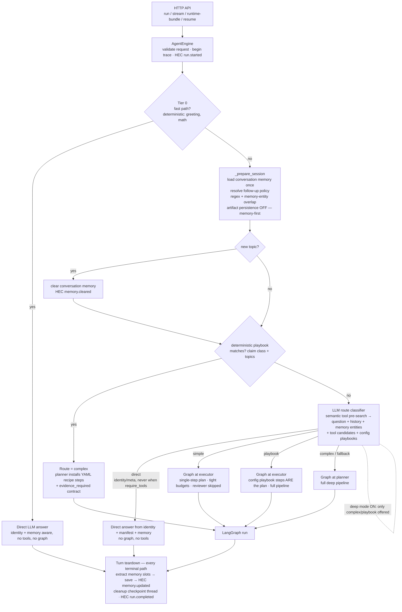
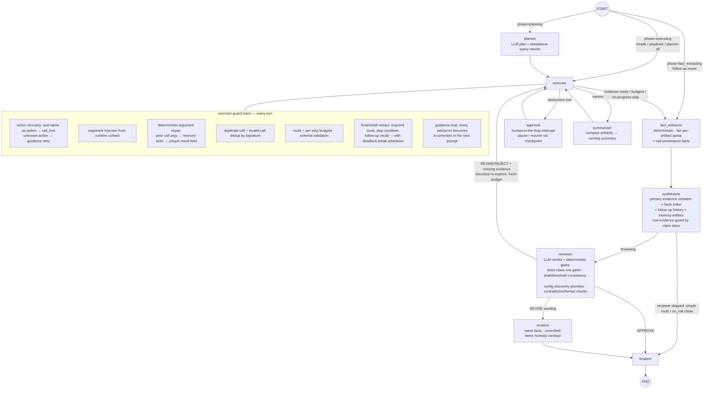
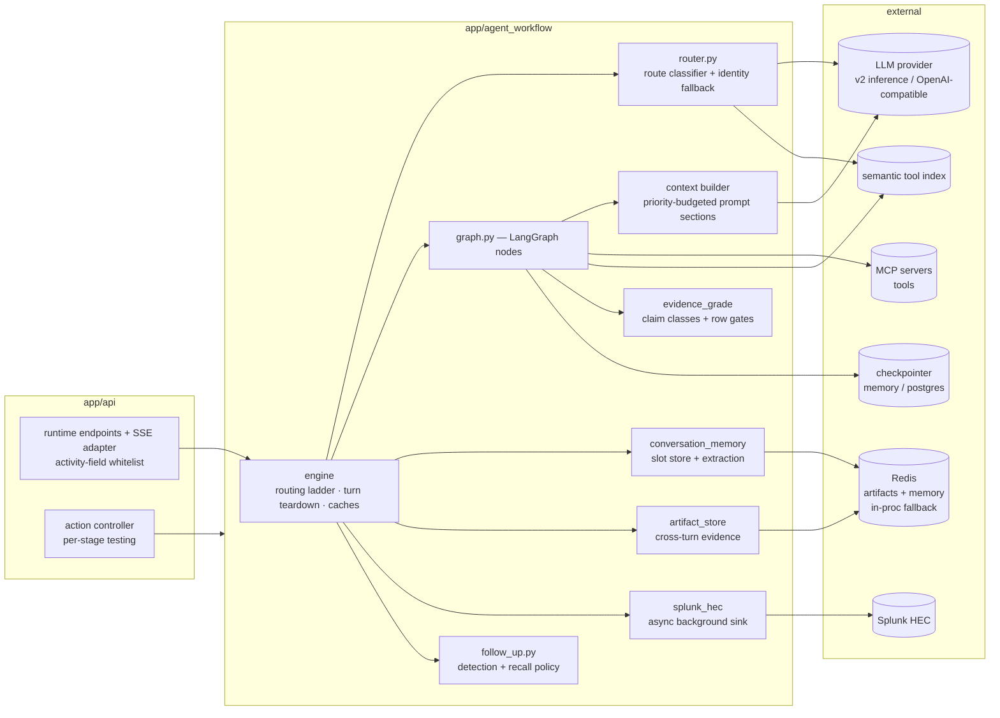

# Agent Workflow Service — End-to-End Architecture Diagrams

Companion to `ARCHITECTURE.md` and `AGENT-WORKFLOW.md`. Three views: the request
lifecycle (routing ladder + teardown), the LangGraph state machine with the
executor's guard stack, and the component/store topology.

## 1. Request lifecycle — routing ladder and turn teardown

Each tier decides only if the tier above didn't. Every terminal path runs the
same finalize sequence.

## 2. The graph and the executor guard stack

## 3. Components and stores

## Reading guide

- **Configuration is the app boundary**: playbooks, identity, instructions,
  discovery priorities, tool policies, budgets, and profiles are all config;
  framework code stays application-agnostic.
- **Trust ladder**: deterministic checks run before LLM judgment at every
  layer (fast path before router; guards before model retries; deterministic
  gates before the reviewer LLM).
- **Every loop has a bounded escape**: iteration caps, no-progress stall stop,
  deadlock-break arbitration, re-explore/review/revision cycle caps, and the
  recursion budget sized from all of them.
- **Evidence requirement flows from config, not regex**: a deterministic
  playbook declares its claim class and stamps `evidence_required` on the plan;
  the row-level gate keys off that plan contract, and the regex claim classifier
  is only the fallback for un-playbooked runs.
- **Continuity is memory-first**: conversation memory carries what the
  conversation established (active entity, collection, output shape — with
  superseded-value history), not raw prior-turn artifacts, which is the right
  granularity for follow-ups.
