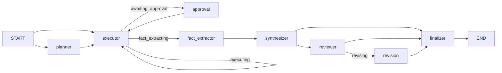

Your refactor is **wired correctly** and matches the architecture we discussed. It’s a meaningful step toward OpenCode-style stability. A few gaps remain before I’d call it fully optimal.

## Verdict: wired properly, not fully optimal yet

The graph implements the intended separation of concerns. The main risks are **fact quality for Splunk dashboards**, **stale config surface area**, and **telemetry/test gaps** — not broken routing.

---

## What’s wired correctly

### Graph flow (`graph.py`)



Confirmed behaviors:

| Design goal | Status |
|-------------|--------|
| Executor = tool orchestration only | Yes — hands off at `phase: "fact_extracting"` (executor.py 594–608, 948–949) |
| Approval only for destructive | Yes — `approval → executor` only; comment at graph.py 122–124 |
| REVISE does **not** return to executor | Yes — `revision → finalizer` (148); no reviewer→executor edge |
| Reviewer judges, revision rewrites | Yes — reviewer.py 58–61, revision.py 10–13 |
| Facts in state between synthesis/review | Yes — `facts` in state.py 94; fact_extractor writes, synthesizer/reviewer/revision read |

`test_executor_finish_last_step_hands_off_to_fact_extractor` and `test_reviewer_revise_keeps_artifacts_and_tool_calls` validate the two most important handoffs.

---

## State model — good shape

```94:99:agent-workflow-service/app/agent_workflow/state.py
    facts: list[Fact]
    draft_answer: str
    draft_kind: str  # "mechanical" (deterministic artifact dump) | "llm" (prose)
    review: ReviewResult
    review_feedback: str
    iteration: IterationCounters
```

`revision_cycles` is bounded (revision.py 16: hard cap at 1). `review_cycles` capped by config. No infinite REVISE→executor loop.

Minor drift: `draft_kind` comment omits `"executor_draft"` (synthesizer.py 19), which affects finalizer skip logic.

---

## Node-by-node assessment

| Node | SRP | Wired | Notes |
|------|-----|-------|-------|
| **fact_extractor** | Excellent (deterministic) | Yes | Line-splitting from artifact summaries may lose panel structure |
| **synthesizer** | Good | Yes | Single authoring pass; `on_risk` skip is smart |
| **reviewer** | Good | Yes | Judge-only; deterministic `_completion_gaps` override is valuable |
| **revision** | Good | Yes | One bounded rewrite; no tools |
| **executor** | Mostly good | Yes | Still allows `draft_answer` escape hatch; some dead synthesis helpers may remain |
| **approval** | Excellent | Yes | Destructive-only |
| **finalizer** | Good | Yes | Skips re-render for `draft_kind == "llm"` |

---

## Issues to fix (by severity)

### High

**1. Fact extractor may still under-serve Splunk dashboards**

`fact_extractor` splits artifact `summary` text line-by-line (fact_extractor.py 56–59). For `get_dashboard` with 16 panels, you still depend on artifact summary quality. If truncator kept only 5 panel lines in the summary, facts will only contain those 5 — synthesizer/reviewer never see the rest.

This is the main remaining quality gap vs OpenCode (which keeps full tool results in-session).

**2. `max_artifact_chars: 6000` in `default.yaml`**

You tuned budgets down (reasonable for inference stability), but `truncation.max_artifact_chars` is back to **6000**. That’s likely to reintroduce panel truncation for dashboard tasks.

**3. Reviewer parsing is fragile**

```170:186:agent-workflow-service/app/agent_workflow/nodes/reviewer.py
def _parse_review_json(text: str) -> dict[str, Any]:
    parsed = parse_executor_action(text)
```

`parse_executor_action` falls back to `{"action": "draft_answer", "answer": <raw>}` when JSON parse fails (parsing.py 66). That means **no `verdict` key** → defaults to **REVISE** (reviewer.py 102–104). Safe but conservative; markdown or prose reviewer output causes unnecessary revision cycles.

`parse_review_markdown` exists but isn’t used by the reviewer node. `prompts/reviewer.md` isn’t loaded — reviewer uses inline system prompt only.

### Medium

**4. `reject_action: abort` is dead config**

Reviewer REJECT sets `phase: "done"` with best-effort draft (reviewer.py 124–127). Nothing routes back to planner. `iteration.replans` in state is never incremented. Config promises behavior the graph doesn’t implement.

**5. Synthesizer skip paths are silent in UI**

When synthesizer skips LLM (no facts, uses executor draft — synthesizer.py 17–22), `_done_or_reviewing` emits **no** `synthesizer.completed` / `synthesizer.skipped` event. Streaming won’t show synthesis activity for those paths.

**6. SSE strips useful activity fields**

`streaming.py` emits `fact_count`, `handoff`, `answer_chars`, but `sse_adapter.py` `_ACTIVITY_FIELDS` (9–26) doesn’t include them — UI may drop that metadata.

**7. Unknown `phase` → `END` without finalizer**

graph.py 177, 187, 197 return `END` for unexpected phases instead of routing to finalizer with an error. Rare, but can produce empty responses.

**8. No end-to-end graph test**

Unit tests cover handoffs and REVISE state preservation, but there’s no golden-path test:

`planner → executor → fact_extractor → synthesizer → reviewer → revision → finalizer`

`test_graph_smoke.py` mocks may still assume the old executor-draft + markdown-review flow for some scenarios.

### Low

- Revision limit hard-coded to 1, not in YAML (`revision.py` 16)
- Synthesizer/revision prompts inline only — not in `default.yaml` / `prompts/`
- `review_feedback` written on REVISE but revision prompt reads from `review` object, not `review_feedback` (works, but `review_feedback` is unused in revision)
- README may still describe old 3-node flow

---

## Config alignment (`default.yaml`)

Your practical tuning looks sensible for inference stability:

- `max_executor_iterations: 10`, `max_review_cycles: 1`
- `reviewer.mode: on_risk` — clean tool runs skip reviewer (matches synthesizer logic)
- `executor.synthesize_max_tokens: 2500` shared by synthesizer + revision

Gaps:

- No dedicated `policy.synthesizer` / `policy.revision` sections (both reuse `executor.synthesize_max_tokens`)
- `truncation.max_artifact_chars: 6000` is tight for Splunk; consider **12000–20000** for dashboard agents only
- `fact_extractor` cap = `max_artifacts_in_prompt * 3` = **30 facts** — fine for most cases

---

## Optimality vs OpenCode

### Wins (you nailed the architecture)

1. **Bounded loops** — no REVISE→executor spiral
2. **Compact facts** for synthesis/review/revision — major token savings
3. **Single synthesis pass** — one main prose LLM call
4. **Risk-gated reviewer** — avoids extra LLM on clean runs
5. **Deterministic fact extraction** — no LLM cost for compression
6. **Approval isolated** to destructive tools

### Remaining gap vs OpenCode stability

OpenCode still wins on **evidence fidelity**: the model sees full tool results in one session. Your pipeline compresses artifacts → facts early. That’s good for cost/stability, but only if fact extraction preserves structured data (panel tables, counts, IDs).

**Highest-impact next improvement** (when you’re ready to code): mechanical fact extractors per tool (`get_dashboard` → structured panel facts), not bigger budgets.

---

## Recommended priority list

1. **Splunk fact fidelity** — mechanical `get_dashboard` / `list_dashboards` fact shaping before line-splitting
2. **Raise `max_artifact_chars`** for dashboard agents (or per-agent override in Studio runtime)
3. **Reviewer parsing** — JSON first, fallback to `parse_review_markdown`; wire `prompts/reviewer.md`
4. **Emit `synthesizer.skipped` events**; extend `_ACTIVITY_FIELDS` with `fact_count`, `handoff`, `answer_chars`
5. **Golden-path integration test** through all 8 nodes
6. **Remove or implement** `reject_action` / `replans` dead config
7. **Default unknown phase → finalizer** with error event

---

## Bottom line

**Wiring: yes — properly connected.**  
**Architecture: yes — matches the design we discussed.**  
**Optimal: mostly — the pipeline shape is right; quality and operability gaps remain in fact extraction, truncation budget for Splunk, reviewer parsing, and telemetry.**
